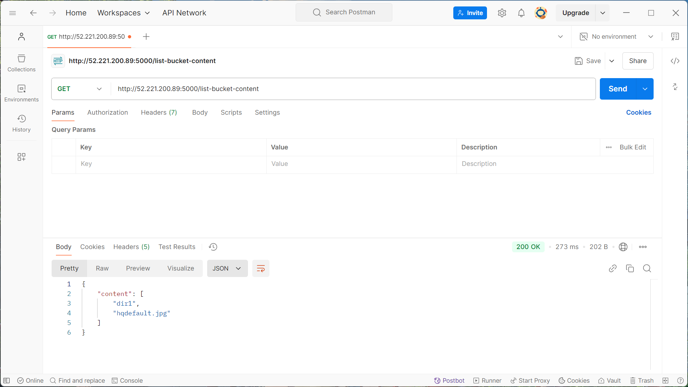
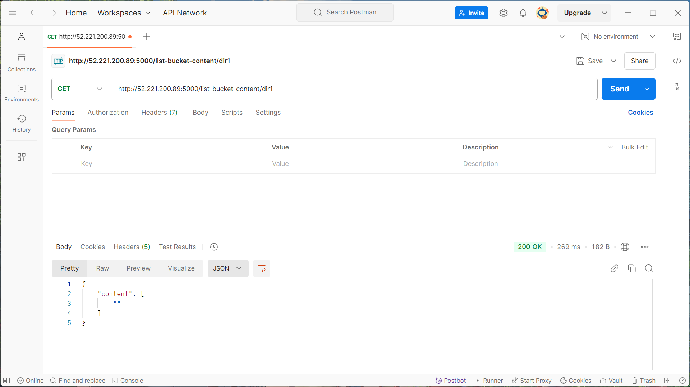

# HTTP Service to List S3 Bucket Contents with Terraform Deployment

This project demonstrates how to create an HTTP service using Python and Flask, which lists the contents of an AWS S3 bucket. Additionally, it provisions the necessary infrastructure and deploys the service on an EC2 instance using Terraform.


## Project Overview

This project involves two main parts:

1. **HTTP Service**: A Python-based HTTP service that interacts with an AWS S3 bucket using the `boto3` SDK to list its contents. The service is built with Flask and exposes a REST API endpoint to fetch the S3 bucket content.

2. **Terraform Deployment**: Provisioning the necessary AWS infrastructure using Terraform and deploying the HTTP service on an EC2 instance.

## Prerequisites

- An AWS account.
- Terraform installed on your local machine.
- Access to an EC2 instance (or use Terraform to provision one).
- Basic knowledge of Python, Flask, and Terraform.

## Part 1: HTTP Service

### Setting Up the Environment

1. **Log into the EC2 instance**:
   - SSH into your AWS EC2 instance where you will host the service.

2. **Install Python 3 and pip**:
   ```bash
   sudo yum install python3 -y
   sudo yum install python3-pip -y
   python3 --version
   pip3 --version
3.Install necessary Python packages:

pip3 install flask boto3

Configure AWS CLI:

    aws configure

    Enter your AWS credentials and region details.

Writing the Application

    Create a project directory:

    mkdir aws_http_service
    cd aws_http_service

    Create the main application file (app.py): In this file, you'll write the Python Flask application to interact with S3 and return the contents of the bucket or a specified directory.

Running the Application

Once the application is written, run the Flask app using the following command:

python3 newcode.py

Testing the API

    Test using Postman or curl:
        Get top-level content:






curl http://<EC2-IP>:5000/list-bucket-content

Get content of a specific directory:

        curl http://<EC2-IP>:5000/list-bucket-content/dir1

Part 2: Terraform Deployment
Installing Terraform

    Install Terraform:

    sudo yum update -y
    wget https://releases.hashicorp.com/terraform/1.x.x/terraform_1.x.x_linux_amd64.zip
    unzip terraform_1.x.x_linux_amd64.zip
    sudo mv terraform /usr/local/bin/
    terraform --version

Configuring Terraform Project

    Create a Terraform project directory:

mkdir terraform-deployment
cd terraform-deployment

Create the following files:

    main.tf: Defines the AWS resources, including the EC2 instance and security groups.
    variables.tf: Input variables used in the configuration.
    outputs.tf: Output values, such as the public IP address of the EC2 instance.
